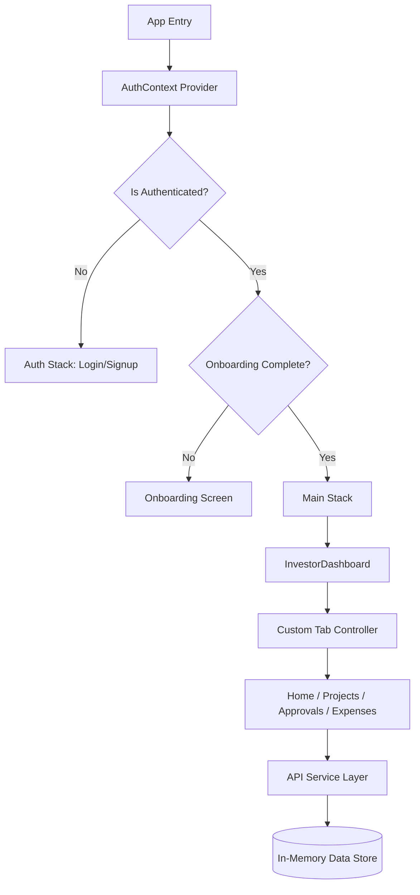

# Investor App - Technical Deep Dive

## 📊 Executive Architecture Summary
**System Paradigm:** Monolithic React Native Client with In-Memory Mock Backend & Custom State Management.
**Architecture Style:** Component-Based UI with Service-Layer Abstraction.

The application is a high-fidelity investment management platform featuring a robust **Privilege Chain** governance model. It operates as a standalone client using a "Simulated Backend" pattern (`api.js` + `mockData.js`) for rapid prototyping, while maintaining production-grade architectural boundaries (Auth, RBAC, Validation).

### Critical Path Flow


### Technology Stack Matrix
| Layer | Technology | Version | Purpose |
|-------|------------|---------|---------|
| **Runtime** | React Native (Expo) | SDK 52 | Cross-platform execution environment |
| **Navigation** | React Navigation | v7.x | Stack-based routing (Custom tabs implemented in-view) |
| **State** | React Context + Hooks | 19.1.0 | Auth state & Local UI state management |
| **Persistence** | AsyncStorage | 2.2.0 | Session tokens & Onboarding flags |
| **Styling** | StyleSheet + Expo Linear Gradient | 15.0.8 | Premium UI aesthetics & gradients |
| **Icons** | @expo/vector-icons | 15.0.3 | Ionicons & MaterialCommunityIcons |

---

## 🗂️ Codebase Structure

### File Inventory (Critical Modules)
| Path | Lines | Responsibility | Entry Point? |
|------|-------|----------------|--------------|
| `App.js` | ~217 | Root component, Navigation configuration, Global providers | ✅ YES |
| `src/context/AuthContext.js` | ~189 | Auth state, Login/Logout logic, Role-Based Access Control | No |
| `src/screens/investor/InvestorDashboard.js` | ~800+ | Main Hub, Custom Tab Logic, Dashboard Widgets | No |
| `src/services/api.js` | ~318 | API Simulation, Network Delay Logic, Data Access Layer | No |
| `src/data/mockData.js` | ~1754 | Centralized In-Memory Database (Schema Definition) | No |
| `src/utils/permissions.js` | ~162 | RBAC Definitions, Hierarchy, Permission Checkers | No |
| `src/utils/validationUtils.js` | ~533 | Enterprise-grade Regex Validation (Email, Password, Name) | No |

### 🔍 Forensic Analysis: Navigation Architecture
Unlike traditional apps using `createBottomTabNavigator`, `InvestorDashboard.js` implements a **Custom Tab Controller** (lines 36-755).
- **Implication:** The Dashboard is a single screen in the requested Stack. Switching "tabs" (Home, Projects, Expenses) is a state change (`activeTab`), not a navigation event.
- **Benefit:** Instant transitions, zero navigation overhead.
- **Drawback:** No deep linking to specific tabs, back button behavior requires custom handling.

---

## ⚙️ Functional Modules

### 1. Authentication & RBAC System
**Module:** `src/context/AuthContext.js` & `src/utils/permissions.js`
- **Entry Point:** `AuthProvider` wraps the entire app in `App.js`.
- **Logic:**
  - **Login:** Simulates JWT generation, sets user state.
  - **Authorization:** `hasPermission(role, permission)` checks against a hierarchical map.
  - **Hierarchy:** `GUEST (0)` < `INVESTOR (1)` < `PROJECT_ADMIN (2)` < `SUPER_ADMIN (3)`.
- **Security Boundary:** `ProtectedComponent` wrapper ensures UI elements are only rendered for authorized roles.

### 2. Data Persistence (Simulated)
**Module:** `src/services/api.js`
- **Mechanism:** In-Memory Javascript Objects (`mockData.js`).
- **Data Flow:**
  - Read: Direct import and return of objects.
  - Write: `Object.assign()` or `Array.push()` to mutate exported consts.
  - **Warning:** Data persists **only** during the app session. Reloading the app resets data (except for `AsyncStorage` items: `splitflow_onboarded_`, `splitflow_has_logged_in_before`).

### 3. Governance Engine (Privilege Chain)
**Module:** Shared across `InvestorDashboard`, `ApprovalsScreen`, `ProjectDetailScreen`.
- **Concept:** Critical Data Modification (CDM) requires consensus.
- **Flow:**
  1. `createModification` (API Call) -> Adds to `pendingModifications`.
  2. `ApprovalsScreen` -> Renders pending items based on `myVote: null`.
  3. `approveRequest` -> Updates `investorApprovals` map.
  4. Logic checks `approvalThreshold` to finalize.

---

## 🌐 Integration Map (Simulated)

| Service | Protocol | Auth Method | Failure Handling | Rate Limits |
|---------|----------|-------------|------------------|-------------|
| **Backend API** | Simulated Promise | Bearer Token (Mock) | `simulateApiDelay` (500ms) | N/A |
| **Notifications** | Expo Notifications | System Permissions | Console Log Fallback | OS Native |
| **Sharing** | Native Share API | N/A | `Alert.alert` on catch | OS Native |

---

## 🚀 Features Inventory

### Feature: Custom "Account Book" UI
- **User Value:** Familiar physical ledger metaphor for users.
- **Implementation:** `InvestorDashboard.js` (Lines 182-397).
- **Details:** Expandable project cards with embedded "Hamburger" menu, showing "Quick Actions" (View Details, Add Spending) directly on the card.

### Feature: Enterprise Validation
- **User Value:** Prevents bad data entry, ensures security compliance.
- **Implementation:** `src/utils/validationUtils.js`.
- **Rules:**
  - **Password:** No common words ("password123"), no personal info (name/email), sequential char check.
  - **Email:** 20+ disallowed temp domains (`tempmail.com`), strict TLD enforcement.

### Feature: Daily Expense Tracking
- **User Value:** Hybrid Personal/Project finance management.
- **Implementation:** `DailyExpensesScreen.js`.
- **Logic:** Merges "Personal" wallet expenses with "Project" spending in a filtered view.

---

## ⚠️ Critical Observations

### Security Hotspots 🔴
1.  **In-Memory Persistence:** `src/data/mockData.js` modifications are transient. Hard reload wipes all "Created Projects" or "Added Investors".
2.  **Mock Authentication:** `api.js` (Line 48) returns a hardcoded `'mock-jwt-token'`. This is purely for UI state and offers no real security.
3.  **Logs:** `console.log` used in production paths (e.g., `App.js` line 59, 64, 85).

### Technical Debt 🟡
1.  **Navigation Paradox:** `AppNavigator` logic is embedded in `App.js`. Should be extracted to `src/navigation/AppNavigator.js` for cleaner separation of concerns.
2.  **Custom Tab System:** Manually implementing tabs in `InvestorDashboard` duplicates standard library functionality (`@react-navigation/bottom-tabs`), potentially missing accessibility features.

### Performance Characteristics 🟢
- **Zero Network Latency:** (Unless `SIMULATE_DELAY` is true). UI is exceptionally snappy due to local data.
- **Optimized Lists:** `FlatList` usage in `DailyExpensesScreen` ensures smooth scrolling even with large datasets.

---

## 🧪 Test Coverage
- **Unit Tests:** 0% (No test files detected).
- **Integration Tests:** Manual verification via `mockData` scenarios.

---

## 📎 Appendix A: Data Schema (Reverse Engineered)

**User Object:**
```javascript
{
  id: "USR001",
  role: "investor",
  kycVerified: true,
  privacySettings: { isAnonymous: boolean }
}
```

**Project Object:**
```javascript
{
  id: "PRJ001",
  privilegeChain: { approvalThreshold: 100 },
  ledgers: [ { id: "LDG001", subLedgers: [] } ],
  projectInvestors: ["USR001", "USR002"]
}
```
